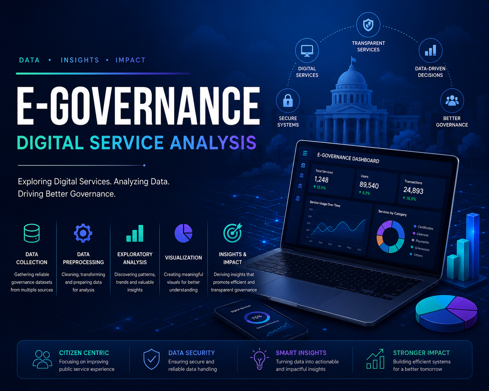
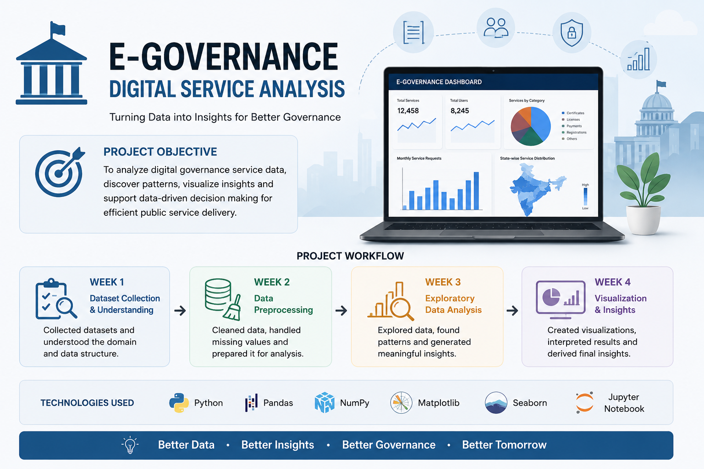

🌐 E-Governance Digital Service Analysis

  

Data Analysis Project Completed During Internship

---

About This Project

Hi, I'm Rohan.

This repository contains the work completed during my internship project based on E-Governance and Digital Service Analysis.

The project involved working with governance-related datasets, understanding the data, performing preprocessing, analyzing patterns, and creating visualizations based on findings.

Instead of completing everything at once, the project was divided week by week so progress and work could be tracked throughout the internship.

---

Project Goals

- Understand governance-related datasets
- Clean and preprocess raw data
- Perform exploratory analysis
- Create visualizations
- Generate observations from datasets

---

Repository Structure

E-Governance-Digital-Service/
│
├── data/
│   ├── raw/
│   └── processed/
│
├── notebooks/
│   ├── Week-1_Dataset_Collection/
│   ├── Week-2_Preprocessing/
│   ├── Week-3_EDA/
│   └── Week-4_Insights_and_Visualization/
│
├── reports/
├── visualizations/
└── docs/

---

Weekly Breakdown

Week 1 — Dataset Collection and Research

- Dataset exploration and understanding
- Domain research
- Understanding project requirements
- Initial observations

Week 2 — Data Preprocessing

- Handling missing values
- Cleaning datasets
- Transforming data
- Preparing datasets for analysis

Week 3 — Exploratory Data Analysis

- Statistical analysis
- Identifying trends and patterns
- Relationship analysis
- Data exploration

Week 4 — Visualization and Findings

- Creating graphs and charts
- Analyzing results
- Documenting findings
- Generating conclusions

---

  

Tools & Technologies

Programming & Analysis

"Python" (https://img.shields.io/badge/Python-3776AB?style=for-the-badge&logo=python&logoColor=white)
"Pandas" (https://img.shields.io/badge/Pandas-150458?style=for-the-badge&logo=pandas&logoColor=white)
"NumPy" (https://img.shields.io/badge/NumPy-013243?style=for-the-badge&logo=numpy&logoColor=white)

Visualization

"Matplotlib" (https://img.shields.io/badge/Matplotlib-11557C?style=for-the-badge)
"Seaborn" (https://img.shields.io/badge/Seaborn-4C72B0?style=for-the-badge)

Development Environment

"Jupyter" (https://img.shields.io/badge/Jupyter-F37626?style=for-the-badge&logo=jupyter&logoColor=white)

---

Skills Developed

Working on this project helped improve understanding of:

- Data preprocessing workflows
- Exploratory Data Analysis (EDA)
- Data visualization techniques
- Working with real datasets
- Converting raw data into observations

---

Repository Contains

- 4 weeks of project work

- Weekly notebooks

- Reports and documentation

- Dataset files

- Visualizations

---

Closing Note

This project provided experience working with datasets in a structured way and applying analysis techniques to understand patterns and generate findings.

This repository documents the work completed throughout the internship journey.

---

Thanks for visiting ⭐

Feel free to explore the notebooks, reports, and visualizations available in this repository.
